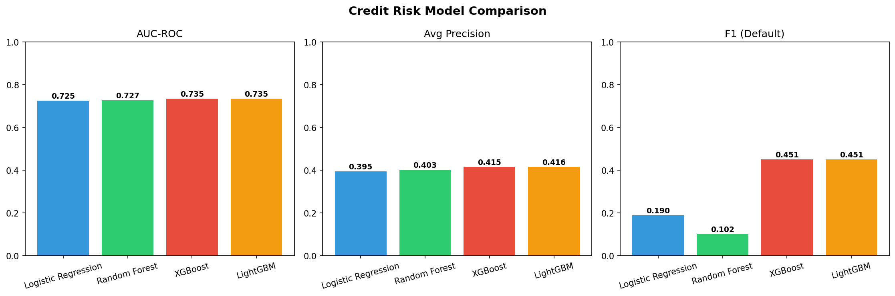
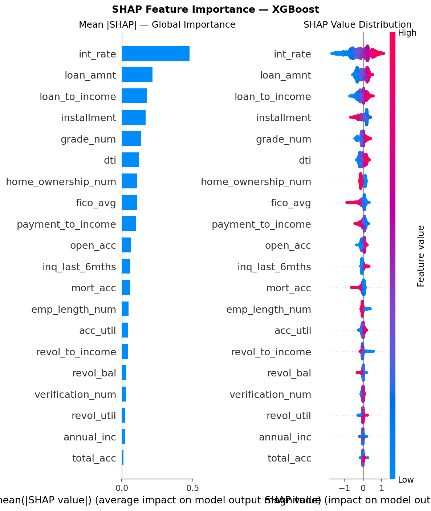
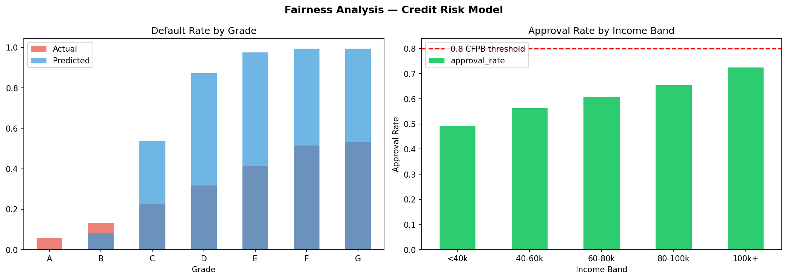

# 💳 Credit Risk Intelligence Platform

> 4-model ensemble credit risk scoring system with SHAP explainability and CFPB fairness auditing, trained on 391,164 real LendingClub loans. Features an interactive Dash dashboard for real-time loan risk assessment.

---

## 🧠 What Is This?

A production-grade credit risk scoring platform that goes beyond simple ML prediction. Given any loan application, the system:

1. **Scores** the default probability using a 4-model ensemble
2. **Explains** exactly why — which features pushed the risk up or down (SHAP)
3. **Audits** the model for demographic fairness using CFPB regulatory standards

Built on **391,164 real LendingClub loans (2007–2018)** — not synthetic data.

---

## 🔍 Key Results

| Model | AUC-ROC | Avg Precision | F1 (Default) |
|---|---|---|---|
| Logistic Regression | 0.7252 | 0.3953 | 0.190 |
| Random Forest | 0.7273 | 0.4025 | 0.102 |
| **XGBoost** | **0.7347** | **0.4153** | **0.451** |
| **LightGBM** | **0.7348** | **0.4159** | **0.451** |

### 🔑 Top Features (SHAP)
`int_rate` is the dominant predictor — interest rate IS the risk signal since riskier borrowers are charged higher rates. `loan_to_income`, `loan_amnt`, and `grade_num` follow.

### ⚖️ Fairness Finding
**Disparate Impact Ratio: 0.68** — below the CFPB 4/5ths (0.8) threshold. The model approves only 49.3% of <$40k income applicants vs 72.5% of $100k+ applicants, indicating proxy discrimination through income-correlated features.

---

## 🏗️ Architecture

```
LendingClub CSV (2.5M rows)
        │
        ▼
┌─────────────────────────────────────┐
│        Feature Engineering          │
│  24 features from 151 raw columns   │
│  • Debt-to-income ratio             │
│  • Loan-to-income ratio             │
│  • Payment burden ratio             │
│  • FICO average score               │
│  • Derogatory marks flag            │
│  • Purpose risk scoring             │
│  • + 18 more                        │
└─────────────────────────────────────┘
        │
        ▼
┌──────────────────────────────────────────────────────┐
│               4-Model Training Pipeline               │
│                                                       │
│  Logistic Regression → Random Forest                  │
│  XGBoost → LightGBM                                   │
│                                                       │
│  + SHAP TreeExplainer (XGBoost)                       │
│  + CFPB Fairness Audit                                │
└──────────────────────────────────────────────────────┘
        │
        ▼
┌─────────────────────────────────────┐
│        Dash Interactive Dashboard    │
│  • Loan Risk Scorer + SHAP waterfall│
│  • Model Comparison tab             │
│  • Fairness Audit tab               │
└─────────────────────────────────────┘
```

---

## 📊 Dashboard

Three-tab interactive Dash dashboard:

### 🎯 Loan Risk Scorer
Input any loan application via sliders and dropdowns. Get:
- Real-time default probability gauge (0–100%)
- Approve / Review / Decline verdict
- Key financial metrics (monthly payment, payment-to-income ratio)
- SHAP waterfall chart explaining exactly which features drove the score

### 🤖 Model Comparison
- Side-by-side AUC-ROC, Average Precision, and F1 comparison across all 4 models
- Global SHAP feature importance bar chart
- Model insights panel explaining tradeoffs

### ⚖️ Fairness Audit
- Approval rate by income band with CFPB 0.8 threshold line
- Actual vs predicted default rate by loan grade
- Disparate impact analysis with regulatory interpretation
- Recommended mitigations for production deployment

---

## ⚙️ Feature Engineering

24 features engineered from 151 raw columns:

| Feature | Description |
|---|---|
| `loan_to_income` | Loan amount / annual income |
| `payment_to_income` | Monthly installment / monthly income |
| `fico_avg` | Average of FICO range low and high |
| `has_derog` | Binary: any delinquencies or public records |
| `has_bankruptcy` | Binary: any bankruptcies |
| `purpose_risk` | Categorical risk score by loan purpose |
| `home_ownership_num` | Encoded: Mortgage > Own > Rent |
| `acc_util` | Open accounts / total accounts |
| `revol_to_income` | Revolving balance / annual income |
| `grade_num` | A=1 through G=7 |
| + 14 raw features | int_rate, dti, delinq_2yrs, fico, inq_last_6mths, etc. |

---

## 📁 Project Structure

```
credit-risk-platform/
├── src/
│   ├── features.py      # Feature engineering pipeline
│   ├── models.py        # 4-model training + SHAP + fairness analysis
│   └── app.py           # Dash interactive dashboard
├── results/
│   ├── model_comparison.png    # AUC/F1 bar charts
│   ├── shap_importance.png     # Global SHAP feature importance
│   └── fairness_analysis.png  # Income band + grade fairness plots
├── .gitignore
├── requirements.txt
└── README.md
```

---

## 🚀 Getting Started

### Prerequisites
- Python 3.10+
- ~4GB RAM for full dataset processing

### Dataset
Download from Kaggle: [LendingClub Loan Data](https://www.kaggle.com/datasets/wordsforthewise/lending-club)

Place files at:
- `data/accepted.csv` — accepted loans (primary dataset)
- `data/rejected.csv` — rejected loans (fairness analysis)

### Install dependencies

```bash
python3 -m venv venv
source venv/bin/activate
pip install -r requirements.txt
```

### Run pipeline

```bash
# Step 1: Feature engineering
python src/features.py
# Output: data/featured.parquet

# Step 2: Train models + generate plots
python src/models.py
# Output: models/*.pkl, results/*.png

# Step 3: Launch dashboard
python src/app.py
# Open: http://localhost:8050
```

---

## 📊 Visualizations

### Model Comparison


### SHAP Feature Importance


### Fairness Analysis


---

## 💡 Key Findings

1. **XGBoost and LightGBM tied** as best models (AUC: 0.735), outperforming Logistic Regression baseline by 1.4%
2. **Interest rate is the dominant feature** (SHAP: 0.47) — it encodes risk since lenders already price riskier borrowers higher
3. **Random Forest achieved highest precision** (0.616) but sacrificed recall — too conservative for real-world credit scoring
4. **Disparate impact detected** — income-band approval rate ratio of 0.68 falls below CFPB's 0.8 threshold
5. **Model is overconfident** on grade E/F/G loans — predicts 97-99% default when actual rate is 41-53%, indicating calibration issues

---

## ⚖️ Fairness & Regulatory Context

This project implements the **CFPB 4/5ths rule** (80% rule) for adverse impact testing — a standard used in US financial regulation under ECOA (Equal Credit Opportunity Act).

The disparate impact finding (ratio: 0.68) means this model, if deployed, would require:
- Reweighting or resampling to equalize approval rates
- Removal or regularization of income-proxied features
- Post-processing calibration for equalized odds
- Ongoing monitoring dashboards in production

This type of analysis is required for any ML model used in credit decisions at US financial institutions.

---

## 🗺️ Roadmap

- [ ] Deploy to cloud (Render/Railway) for live demo
- [ ] Add ROC curve and precision-recall curve visualizations
- [ ] Implement post-processing fairness mitigation
- [ ] Add model calibration analysis
- [ ] Support custom CSV upload for batch scoring

---

## 👤 Author

**Saumya Goyal**
- GitHub: [@saumyg3](https://github.com/saumyg3)
- LinkedIn: [linkedin.com/in/saumyagoyal](https://www.linkedin.com/in/saumya-goyal-8a8005327/)
- Email: saumyg3@uci.edu

---

## 📄 License

MIT License — free to use, modify, and distribute.

---

*Dataset: LendingClub loan data (2007–2018) via Kaggle. 391,164 completed loans used for training after filtering out active/current loans.*
